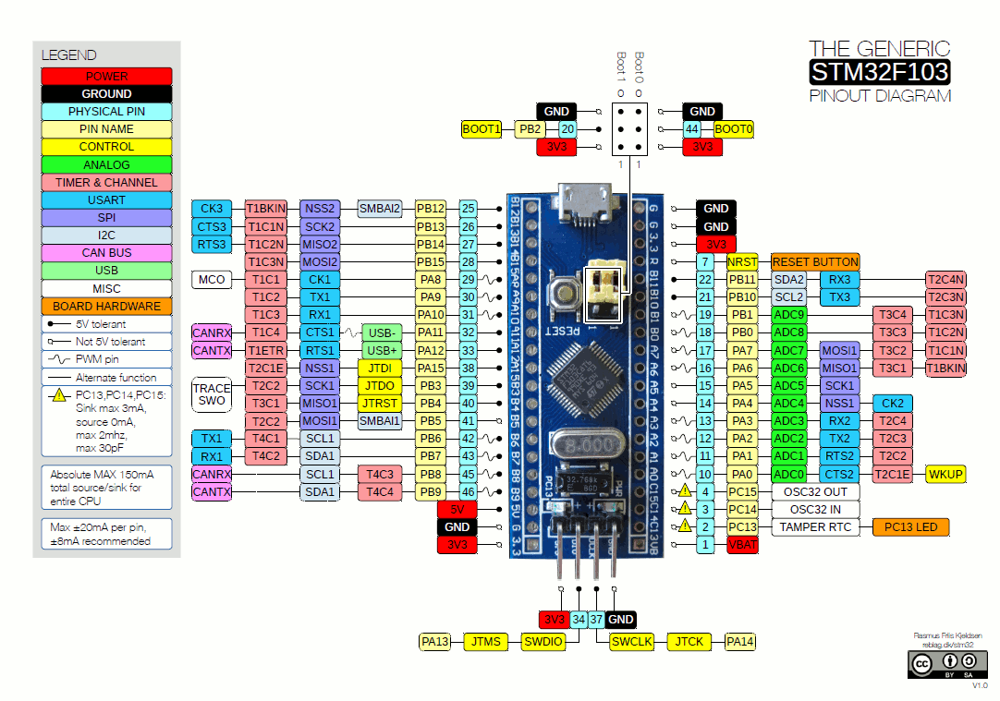

# ***STM32F103C8T6 (Blue Pill) Bare Metal Repository***

---
Hi! I am a beginner and trying to program the Blue Pill Module using Bare Metal (Register-Level) Programming. This repository is only meant for learning purpose. Kindly inform in case of any mistake and if possible suggestions to resolve it. For any other suggestions you can connect with me on LinkedIn: [Shrey Shah](https://www.linkedin.com/in/shreyshah1710/)

Few GitHub Repositories that I had used for learning purpose during development phase:
- [stm32f1-baremetal](https://github.com/csrohit/stm32f1-baremetal/tree/main)
- [stm32f103-1](https://github.com/freesources/stm32f103-1)
---

---
## ***Description***
	- Basic Repository for understanding the Registers present in Blue Pill Development (STM32F103C8T6) Module
	- Created basic source files to use Registers for controlling purpose
	- `Projects/Template` is the reference template

---
## ***Repository Structure***
	- `BareMetal`: Consists of all the Register Address Mapping along with Driver Source Code
	- `Projects`: Consists of User Specific Application
	- `Reference_Docs`: All the Reference Documentation relevant to the topic

---
## ***STM32F103C8T6 Reference Manual***
[STM32F103C_Reference_Manual.pdf](./Reference_Docs/STM32F103C_Reference_Manual.pdf)

---
## ***STM32F103C8T6 Pinout***


---
## ***STM32F103C8T6 Features (Medium Density Device)***
| Specification      | Details        | Comments            |
|--------------------|----------------|---------------------|
| Processor          | ARM Cortex-M3  | Single Core         |
| Clock Frequency    | Min: 8MHz      | HSI: 8MHz           |
|                    | Max: 72MHz     | HSE: 8MHz           |
| Flash              | Size: 64kB     | Address: 0x08000000 |
| SRAM               | Size: 20kB     | Address: 0x20000000 |

---
## ***IRQ Details***
| **Vector Table**         | 76 |
|---------------------------|----|
| ***ARM Cortex-M3 IRQ***   | 11 |
| ***STM32F103C8T6 IRQ***   | 59 |
| ***Reserved***            | 6  |

---
## ***Boot Process***
1. **Power ON**
2. **Stack Pointer (SP)** 
	 - Points to the top of SRAM (Vector Table Offset: `0x00`)
3. **`Reset_Handler()` is called** 
	 - Vector Table Offset: `0x01`
	 - **Initialization Steps:**
		 1. Copy the **`.data`** section from FLASH to SRAM 
				- **Note:** `.data` refers to initialized variables.
		 2. Initialize the **`.bss`** section to `0` 
				- **Note:** `.bss` refers to uninitialized variables.
		 3. Call the **Main function**

---
## ***Repository Structure***
```
.
├── BareMetal
│   ├── Core
│   └── Driver
├── Projects
│   ├── DMA
│   ├── GPIO
│   ├── PWM
│   ├── Template
│   ├── Timer
│   └── USART
├── README.md
└── Reference_Docs
    ├── Arm Cortex M3 Reference.pdf
    ├── Blue_Pill_Pinout.gif
    ├── MAX30102_TD.pdf
    ├── OLED SSD1306.pdf
    ├── STM32F103C8T6_Datasheet.pdf
    ├── STM32F103C_Flash_Programming_Manual.pdf
    ├── STM32F103C_Reference_Manual.pdf
    ├── STM32F103xx_Flash_Reference_Manual.pdf
    └── The STM32F103 Arm Microcontroller_Majizidi.pdf
```

## ***Driver Structure***
```
Driver
├── ADC
│   ├── Inc
│   │   └── adc.h
│   └── Src
│       └── adc.c
├── bare_metal.h
├── DMA
│   ├── Inc
│   │   └── dma.h
│   └── Src
│       └── dma.c
├── EXTI
│   ├── Inc
│   │   ├── exti.h
│   │   └── nvic.h
│   └── Src
│       └── exti.c
├── GPIO
│   ├── Inc
│   │   ├── gpio_config.h
│   │   └── gpio.h
│   └── Src
│       └── gpio.c
├── I2C
│   ├── Inc
│   │   ├── i2c_config.h
│   │   ├── i2c_dma.h
│   │   ├── i2c.h
│   │   ├── i2c_irq.h
│   │   └── i2c_rb.h
│   └── Src
│       ├── i2c.c
│       ├── i2c_config.c
│       ├── i2c_dma.c
│       ├── i2c_irq.c
│       └── i2c_rb.c
├── PWM
│   ├── Inc
│   │   ├── pwm_config.h
│   │   └── pwm.h
│   └── Src
│       ├── pwm.c
│       └── pwm_config.c
├── RCC
│   ├── Inc
│   │   ├── rcc_config.h
│   │   └── rcc.h
│   └── Src
│       ├── rcc.c
│       └── rcc_config.c
├── reg_map.h
├── Ring_Buffer
│   ├── Inc
│   │   ├── ring_buffer_config.h
│   │   └── ring_buffer.h
│   └── Src
│       └── ring_buffer.c
├── SSD1306
│   ├── Inc
│   │   ├── ssd1306_config.h
│   │   ├── ssd1306_disp.h
│   │   ├── ssd1306_font.h
│   │   ├── ssd1306_frame_rb.h
│   │   ├── ssd1306.h
│   │   ├── ssd1306_i2c.h
│   │   ├── ssd1306_rb_codec.h
│   │   └── ssd1306_rb.h
│   └── Src
│       ├── ssd1306.c
│       ├── ssd1306_frame_rb.c
│       ├── ssd1306_rb.c
│       └── ssd1306_rb_codec.c
├── startup.h
├── Timer
│   ├── Inc
│   │   ├── timer_config.h
│   │   └── timer.h
│   └── Src
│       └── timer.c
└── USART
		├── Inc
		│   └── usart.h
		└── Src
				└── usart.c
```

## ***Project Structure***
---
```
<Project_Name>
├── CMakeLists.txt						# CMake Configuration File
├── generate_vscode.cmake     # Generates /.vscode
├── Inc
│   ├── main.h								# Main Header File
│   └── systick.h							# Systick Header File
├── Src
│   ├── main.c								# Main Source File
│   ├── startup.c							# Startup Source File
│   ├── systick.c							# Systick Source File
└── Startup
    └── stm32f1_ls.ld					# Linker Script File
```

---
## ***Makefile Basic Commands***
	- `make all`: Compiles all the relevant files and generates the executable in a "Build" Directory
	- `make clean`: Removes the "Build" Directory
	- `make flash`: Flashes .bin file at Flash Address (`0x080000000`)
	- `make erase_flash`: Erases the Flash Memory of Blue Pill Module
	- `make debug`: Creates the .json debug related files for Arm-Cortex Debug (VS Code) inside a .vscode directory
	- `make replace_makefiles`: Updates all Makefiles inside "Project" directory with current Makefile
	- `make info`: Provides information about the connected STM32 device
---
